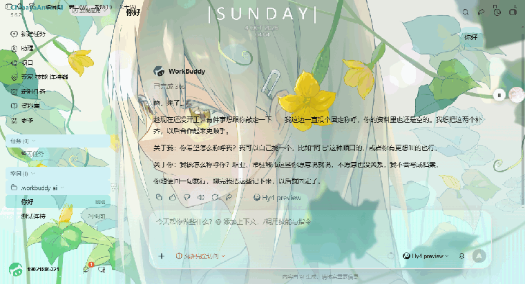

<div align="center">


# AnonBuddy Skin

**让你的 WorkBuddy 跑起 Wallpaper Engine 的场景壁纸**

粒子在飘、模型在动、鼠标带着视差、作者写的脚本在运算、场景自带的音频在响。不是截一张图糊在背景上，是本机实时渲染。

<sub>不改 app.asar · 不装运行时 · 双击即用 · 关掉即还原</sub>

<br>


<br>

**上手** · [装](#装) · [让 AI 帮你装](#让-ai-帮你装)

**功能** · [壁纸库](#壁纸库) · [外观](#外观) · [内置主题](#内置主题) · [界面](#界面)

**深入** · [它不动你的电脑](#它不动你的电脑) · [同类工具怎么做](#同类工具通常怎么做) · [原理与边界](#原理与边界) · [常见问题](#常见问题) · [进阶用法](#进阶用法) · [出处与许可](#出处与许可)

</div>

---



> 上面这张是实录，不是拼的：场景壁纸在水下飘，而玻璃侧边栏、输入框照常工作。它是一层真在跑的渲染，不是贴上去的图。

## 特性

- **场景壁纸本机实时渲染** —— Wallpaper Engine 的 `.pkg` 场景在 WorkBuddy 里真跑。粒⼦、骨骼模型、鼠标视差、作者脚本、场景音都在动。随包的 WebWallGL 复刻了 WE 的引擎语义，950KB、运行期一次外网都不联
- **四档降级，任何情况下不黑屏** —— 实时渲染 → 静态 4K 贴图 → 创意工坊预览图 → 主题取色渐变。跑不动就往下掉，掉到底也还有画面
- **自动发现本机壁纸库** —— 从常见 Steam 位置摸起，读 `libraryfolders.vdf` 认下所有库。多盘、换机、换盘符都不用改配置。没有 WE 也能用手动目录
- **液态玻璃外观 + 自动调优** —— 六个参数分「壁纸」「液态玻璃」两组；点一下「自动调优」，它看当前壁纸一眼就把参数调协调（见[外观](#外观)）
- **一键更新** —— 设置面板里点一下直接换成最新版，不用去 GitHub 手动下载。连不上时自动换镜像源
- **传一张图就是一个主题** —— 主色辅色自动从画面里取，可改名、删除、设为开机默认
- **国际版 / 国内版一份搞定** —— 下错了自动回退到另一个，两个版本同时装着也互不干扰
- **改前先备份，随时一键还原** —— 桌面图标、开始菜单、自启注册表被动过的地方都能还原
- **AI 助手可读的安装协议** —— 复制一段话给任意 AI，它自己判断版本、下载、安装、验证

## 它不动你的电脑

装之前你可能想知道这个：**它凭什么敢说自己安全。**

- **`app.asar` 从头到尾没人碰** —— 不改、不替、不接管。应用签名、安装目录同理
- **只绑 `127.0.0.1`** —— CDP 端口与更新端点都只在本机回环。只有回环能连（注意：同用户下的其他程序也能连，挂皮肤时别乱跑来源不明的程序）
- **注入跟着渲染进程走，进程一没皮肤就没** —— 这是我们故意的。不留残留，随时可以当它没来过
- **壁纸素材只读** —— 只读你本机路径，不复制、不改写、不再分发
- **渲染引擎在本机** —— 950KB 随包分发（WebWallGL，MIT），不从 CDN 取，运行期一次外网都不联
- **唯一的出站请求是"检查更新"** —— 只有你点那个按钮才会发，而且只读 GitHub 的版本号

反悔也一样容易：

```
一键换肤.vbs        ← 装上（推荐，全程不弹窗）
一键换肤.bat        ← 同上，但会打印说明并停在结尾，首次安装或排错时看它
一键还原.bat        ← 卸掉，或者把文件夹删了也行
setup-autoskin.ps1 -ListOnly   ← 先看会改哪些启动入口，什么都不改
setup-autoskin.ps1 -Undo       ← 从备份还原成原来的快捷方式
```

改你的桌面图标、开始菜单、自启注册表之前，会先备份。

## 装

去 [Releases](https://github.com/2939332182/anonbuddy-skin/releases/latest) 下载对应版本的包，解压到哪儿都行，双击 `一键换肤.vbs`（或 `一键换肤.bat`）。

| 你装的是 | 下载 | 主程序 | 端口 |
|:---|:---|:---|:---|
| 国际版（`workbuddy.ai`） | `chihayaanon-skin-<版本>-intl.zip` | `WorkBuddyAI.exe` | 9333 |
| 国内版（`workbuddy.cn`） | `chihayaanon-skin-<版本>-cn.zip` | `WorkBuddy.exe` | 9334 |

**懒得分辨自己装的哪个版本？不用管。** 下错了会自动回退到另一个，两个包里的插件代码完全一样，只有主程序名和预设端口不同。两个版本装在同一台机器上也互不干扰——单实例锁、任务栏分组、卸载项 GUID 各不相同。

真的想确认，查进程名：

```powershell
Get-Process | Where-Object { $_.ProcessName -like '*WorkBuddy*' } | Select-Object -Unique ProcessName
# WorkBuddyAI -> 国际版    WorkBuddy -> 国内版
```

不用找安装目录、不用自己开调试端口、不用装 Python 或任何运行时。包会扫 51 个常见路径再读注册表卸载项来定位 WorkBuddy，Node 优先用应用自带的那份。

> [!WARNING]
> 双击前把 WorkBuddy 里没保存的东西存一下，它会被重启。

### 让 AI 帮你装

懒得自己动手，就把下面这段整块复制给任意 AI 助手——Claude Code、Cursor、WorkBuddy 自己都行。它会自己判断版本、下载、安装并验证，你不用管中间步骤。

```text
从 https://github.com/2939332182/anonbuddy-skin 给我装 AnonBuddy Skin，给 WorkBuddy 换肤。先读
仓库里的 SKILL.md，然后按它执行：用 Get-Process 确认是国际版（WorkBuddyAI）还是国内版
（WorkBuddy），下载对应的 release 包，解压后运行 一键换肤.vbs，最后用 node src/cli.mjs status
确认 installed: true。apply 会重启 WorkBuddy，动手前提醒我存盘；不要修改 app.asar。
```

完整流程写在 [`SKILL.md`](SKILL.md) 里，AI 读完会知道每一步该做什么。

## 功能

| 功能 | 说明 |
|:---|:---|
| **场景壁纸实时渲染** | 本机跑真引擎，不是截图。见[壁纸库](#壁纸库) |
| **一键更新** | 面板里点一下直接装最新版，全程不用离开。连不上 GitHub 自动换镜像源 |
| **外观调节 + 自动调优** | 六个参数两组，点「自动调优」按当前壁纸算一组协调值。见[外观](#外观) |
| 五款内置主题 | 装上就有，右上角悬浮球点开即换，不用重启。选「原生界面」一秒还原 |
| 壁纸音量与联动 | 视频壁纸的暂停与音量联动；场景壁纸的声音走渲染引擎，开关一样管用 |
| 评级筛选与翻页 | 手动目录、评级筛选（全部 / G / PG-13 / R18）、每页九张 |
| 文案替换 | 侧边栏应用名、欢迎页主标题都能改成你喜欢的句子，主标题还能逐字打出来 |
| 自定义皮肤 | 传一张图就是一个主题，主色辅色自动从画面里取。右键可改名、删除、设为开机默认 |
| 开机自带皮肤 | 双击一次就把桌面图标、开始菜单和开机自启接到静默启动器上，往后开机即带皮肤、全程不弹窗 |

## 壁纸库

自动发现部分写在上面「特性」里了，这里说能放什么。

没有任何写死的路径。启动后从几个常见的 Steam 位置摸起，读 `libraryfolders.vdf` 认下所有库，在 `steamapps/workshop/content/431960/` 里读 `project.json` 列清单。换台电脑、换个盘符都不用改配置。

| 类型 | 素材在哪 | 怎么用 |
|:---|:---|:---|
| 视频壁纸 | 工程根目录的 `.mp4` / `.webm` | 直接 `<video>` 播放，声音开关 + 音量滑块 |
| 场景壁纸 | 打包在 `scene.pkg` 里 | **本机实时渲染**（见下）；没就绪或跑不动时退回 RePKG 解出来的 4K 静帧 |
| 网页壁纸 | `files/index.html` | 当不了背景，退化成创意工坊那张预览图 |

没有 Wallpaper Engine 也能用：面板里挑个文件夹，里面的视频和项目都能当壁纸库。

场景壁纸里通常打包着几十张贴图，RePKG 解包后按「16:9 优先、面积次之」挑一张当静帧——这是降级链的第二档：真渲染还没就绪、或这台机器跑不动时，它就是你看到的画面。只按体积挑的话，32 个样本里只有 13 个选对比例，其余会挑中竖版立绘或 256×256 缩略图。

### 场景壁纸是真渲染

慢的那部分被一张已经存在的图遮住，所以感觉不到背后有引擎：

| 步骤 | 背后发生什么 | 你看到什么 |
|:---|:---|:---|
| ① 立即 | 静态 4K 贴图铺上（几十毫秒） | 壁纸立刻换了 |
| ② 异步 | 后台加载引擎 → 解析 pkg → 等首帧 | 界面已经能用了 |
| ③ 首帧就绪 | 渲染层淡入 450ms，静帧被顶替 | 画面「更顺滑了」 |
| ④ 任何一步失败 | 静默留在静帧上 | 什么都没发生 |

降级链四档，任何情况下都不会黑屏：**实时渲染 → 静态 4K 贴图 → 创意工坊预览图 → 主题取色渐变**。

实测（RTX 3050，30fps 上限，国际版与国内版各跑一遍）：

| 场景 | 层数 | pkg | 帧率 | 界面可用性 |
|:---|---:|---:|---:|:---|
| 蓝屏绫波丽 | 2 | 1.7MB | 30 ~ 35 | 不受影响 |
| 初音未来 before light | 6 | 34MB | 28 ~ 30 | 不受影响 |
| 熠烛 御剑驭龙 | 65 | 58MB | 3 ~ 4 | 不受影响 |

重场景（65 层 + 4096×2296）掉到个位数——卡的是画面流畅度，不是你的工作。界面照常点，换个轻点的壁纸帧率就回来了。

> [!NOTE]
> 壁纸指向的是**你本机**的路径，换台电脑就失效。创意工坊内容版权归原作者，别打包分发。

## 外观

壁纸只是背景，**能不能看清字**才是它能不能用的分界。这一块从两个滑块重做成了一套：

**壁纸组** —— 壁纸模糊、磨砂遮罩（把壁纸对比度压下来，保证前景文字读得清）
**液态玻璃组** —— 玻璃模糊、玻璃通透、顶部高光、边缘描边

玻璃只加在**有边界的卡片**上（侧边栏、输入框、设置面板），整片内容区刻意不参与——一模糊整个视野的背部就糊成一片，反而像壁纸没加载。玻璃的"厚度"来自三条内阴影（顶部 1px 高光 + 底部亮边 + 0.5px 发丝环）加一层白釉渐变，而不是来自更强的模糊。

### 自动调优

懒得一项项试，点「自动调优」：

1. 把当前壁纸缩到 64×64，按 4bit/通道量化后取**画面占比最大色**（用众数而不是平均色——平均色会被大片背景稀释成"哪张壁纸都差不多"的灰）
2. 算 WCAG 相对亮度判定这张壁纸偏明还是偏暗
3. 据此调四项：**亮壁纸**压不住文字 → 遮罩给足、玻璃底更实；**暗壁纸**自己就压得住 → 遮罩给少，而高光与描边要加，否则那两道白边出不来、玻璃看着脏

拿不到画面（壁纸还没加载、跨源取不到像素）时它会说「读不到壁纸」，不会假装成功。

**设置窗口里改，主界面立刻跟着变** —— 设置是独立窗口，而 CSS 变量每个文档各写一份，所以两边靠事件同步，松手即生效。

## 内置主题

| 主题 | id | 强调色 |
|:---|:---|:---|
| 爱素 | `aisu` | `#e09c84` |
| 春至双背景 · 昼 | `chunzhi-day` | `#dd9fa6` |
| 春至双背景 · 夜 | `chunzhi-night` | `#5d81da` |
| Hatsune Miku · 海色 | `miku-sea` | `#0d9cfa` |
| Summer Moon Hana 4K | `summer-moon` | `#8284f3` |

明暗按 `theme.json` 的 `colors.surface` 判定，和 WorkBuddy 自带外观联动。自己加一款：把 `theme.json` 和 `hero.webp` 丢进 `themes/你的id/` 再 apply 一次，id 只能用小写字母、数字和连字符。

## 界面

<div align="center">


<table>
<tr>
<td></td>
<td></td>
</tr>
</table>

</div>

## 同类工具通常怎么做

没打算踩谁，但你在几个工具里挑的时候，这张表可能有用：

| | 本工具 | 常见换肤工具 |
|:---|:---:|:---:|
| 场景壁纸**实时渲染**（粒子 / 视差 / 脚本 / 场景音） | ✅ | ❌ 静态截图 |
| 四档降级，失败不黑屏 | ✅ | ❌ |
| 自动发现 WE 订阅库（多 Steam 库 / 跨盘） | ✅ | ❌ 手填路径 |
| **一键更新**（站内完成、多镜像回退） | ✅ | ❌ 手动下载替换 |
| **外观自动调优**（按壁纸算参数） | ✅ | ❌ 全靠手拧 |
| 双击一下就能装，不用装运行时 | ✅ | 常需 Python / ffmpeg / 手动开调试端口 |
| 国际版 / 国内版自动回退 | ✅ | ❌ |
| 接管桌面图标 / 开始菜单 / 开机自启 | ✅ | 部分 |
| 改前备份 + `-ListOnly` 先看后改 + 一键回滚 | ✅ | 少见 |
| 启动全程零窗口（无黑框、无 PowerShell） | ✅ | ❌ 常见闪窗 |
| AI 助手可读的安装协议（`SKILL.md`） | ✅ | 少见 |

**一句话概括区别**：多数换肤工具换的是"颜色"，这个换的是"背景里那个东西在动"。前者一张图就能实现，后者要真的把场景引擎搬进来——这也是唯一一项没法靠改两行 CSS 追上的。

## 开机自带皮肤

皮肤注入在渲染进程里，所以「怎么启动」决定了它还在不在。桌面双击、开始菜单、开机自启这些默认入口都是裸启动，没有调试端口，注入器接不上。

双击一次 `一键换肤.vbs` 时会顺手把这件事办了：翻出所有指向 WorkBuddy 的启动入口（桌面快捷方式、开始菜单、任务栏固定项、自启注册表项），改成走静默启动器 `scripts/autoskin-launch.vbs`，带端口启动、等渲染进程、注入、退出。**全程零窗口**，也不常驻内存。

有个坑值得知道：WorkBuddy 每次启动都会把它**自己**的开机自启项改回"裸启动"（不过新版已经绕开了——插件用自己的启动项，并在每次启动后自动核对一遍）。所以这件事现在是稳的。

改动前会先备份：

```powershell
.\scripts\setup-autoskin.ps1 -ListOnly    # 先看会改哪些入口，什么都不改
.\scripts\setup-autoskin.ps1 -Undo        # 从备份还原成原来的快捷方式
```

它只认**目标可执行文件完全相同**的入口，所以两个版本同时装着也不会互相干扰。

> [!IMPORTANT]
> 有个前提：WorkBuddy 此刻正开着而且是裸启动的话，第一次得手动退出（右键托盘图标选「退出」）。之后一律用快捷方式启动，就再也不会落进那个状态。
>
> 为什么不能自动关：WorkBuddy 进程带保护（内置图灵盾），`Stop-Process`、`taskkill /F` 全被拒，连读它的进程所有者都不行。点窗口右上角 × 也只是缩到托盘，进程照样活着。

## 常见问题

- **换完没反应**：跑 `node src/cli.mjs status`，`installed` 是 `false` 就重跑一次 apply
- **重启后皮肤没了**：故意的。注入的生命周期跟着渲染进程走，重跑 apply 就行；接好启动入口就开机自带
- **找不到 WorkBuddy**：`node scripts\find-workbuddy.mjs` 会列出试过的所有候选路径和命中的那一个
- **壁纸列表是空的**：先确认 Wallpaper Engine 里有订阅；没有就用面板上的「手动目录」挑个文件夹
- **场景壁纸只有静帧不动**：说明引擎没跑起来（机器太重或 pkg 有问题），它已经自动退到静态 4K 了，画面不受影响
- **设置窗口里改了外观，主界面没变**：早期版本有这个 bug（两个窗口各写各的 CSS 变量），现在靠事件同步；如果你还在旧版，更新一下就有
- **点「一键更新」说连不上更新服务**：说明守护进程没在跑。用 `一键换肤.vbs` 重新启动一次即可

## 原理与边界

WorkBuddy 是 Electron 应用，渲染进程跑在 `file://` 页面上。用 `--remote-debugging-port` 把它重启起来，通过 CDP 接上 renderer，注入一份 CSS 和一段脚本：CSS 覆盖 WorkBuddy 自己的 `--cb-*` 设计变量、铺背景图层、调透明度与模糊；脚本负责主题菜单、文案替换、逐字动画和壁纸的生老病死。

```
┌─────────────────────┐                          ┌─────────────────────┐
│      WorkBuddy      │   CDP · 127.0.0.1:9333   │    AnonBuddy Skin   │
│      (Electron)     │ ◄──────────────────────► │    launch-and-skin  │
│                     │        port 9334         │    skin-guard.mjs   │
│      renderer       │ ◄─── inject CSS + JS ─── │                     │
│      file:// page   │                          │    loopback only    │
└─────────────────────┘                          └─────────────────────┘
          │                                                 ▲
          │  app.asar / signature / install dir — untouched  │
          └─────────────────────────────────────────────────┘
                  更新端点 127.0.0.1:10333（CDP 端口 + 1000）
```

没有构建步骤，没有原生依赖，注入的就是一段普普通通的 JavaScript。安全边界那几条在上面《它不动你的电脑》里说过了，这里不重复。

**关于"一键更新"为什么需要一个额外端口**：渲染进程是 `file://` 页面，写不了文件系统；更新的下载与解包因此只能由常驻的 Node 守护进程来做。它开一个只绑回环的小端点，面板点按钮打过去。端口取 `CDP 端口 + 1000`，因为渲染进程读不了文件，除了"约定好的端口"没有别的会合点。

## 进阶用法

<details>
<summary>命令行</summary>

```bash
node src/cli.mjs list                 # 列出所有主题
node src/cli.mjs apply                # 应用默认主题
node src/cli.mjs apply --theme aisu   # 指定一款，last 恢复上次用的
node src/cli.mjs pause                # 卸掉皮肤
node src/cli.mjs status               # 看看注入上了没
node src/cli.mjs doctor               # 环境自检
node src/cli.mjs create --image a.png --name "我的主题"
node src/cli.mjs we                   # 盘点本机壁纸库
```

指定端口换另一个版本：`node src/cli.mjs apply --port 9334`。

从源码跑：`node scripts\launch-and-skin.mjs`（启动 + 注入一步到位，`--prefer cn` 指定版本）。它只在应用没带着调试端口跑的时候才需要；已经带端口开着的话直接 `node src/cli.mjs apply` 就行。找不到 WorkBuddy 先跑 `node scripts\find-workbuddy.mjs`。

装在非标准位置就设一次环境变量：

```powershell
[Environment]::SetEnvironmentVariable('WORKBUDDY_EXE', 'D:\path\to\WorkBuddyAI.exe', 'User')
```

</details>

<details>
<summary>开发与打包</summary>

```bash
npm run test:static   # 静态检查，不连应用，几秒钟
npm run test:core     # 注入 / 还原 / 幂等
npm run test:ui       # 布局和视觉
```

`node scripts/run-tests.mjs --list` 能看到每个套件管什么。打包：`node packaging/build-package.mjs`，默认出 cn 和 intl 两个包，`--edition cn` 只出一个。

仓库里还有个 `scripts/make-skin-from-we.mjs`，能从任意 Wallpaper Engine 条目一键搓出主题：解码、抽帧、取色全在渲染进程里做，不依赖 ffmpeg 也不依赖 sharp。

</details>

## 出处与许可

从 **WorkBuddy Skin Studio · WorkBuddy 换肤工作室** 长出来的。CDP 注入这套骨架、`--cb-*` 的用法、菜单和设置面板的结构都来自那里。这个 fork 接着往下走：接上 Wallpaper Engine 壁纸库，重做自定义皮肤链路，内置主题换成二次元向的选图，补上双版本包和 5.6 兼容。

- **WorkBuddy Skin Studio · WorkBuddy 换肤工作室**：一切的起点
- **RePKG**（MIT）：解场景壁纸用，随仓库带着，不需要 .NET 运行时
- **WebWallGL**（MIT，oneincase）：场景壁纸的实时渲染器，随包分发、不联网；它把 WE 引擎语义复刻得足够好，才有「真渲染而不是截图」这一档

代码走 MIT。商标与素材声明：

- 本项目面向本机运行的 WorkBuddy 桌面端做界面增强，**与腾讯及其官方产品无隶属关系**
- WorkBuddy、WorkBuddy AI 的名称与商标归其权利人所有，本项目未获得其官方授权或认可
- 内置主题的背景图取自 Wallpaper Engine 创意工坊，版权归各自作者，仅作展示随仓库分发。如果你是作者并且希望移除，开个 issue 就好

---

<div align="center">
<sub>做了挺久，用着还行的话给个 star——不是为了好看，是让搜「WorkBuddy 换肤」的人先看到真渲染的那个。</sub>
</div>
