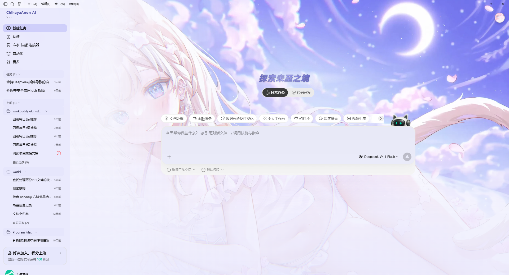
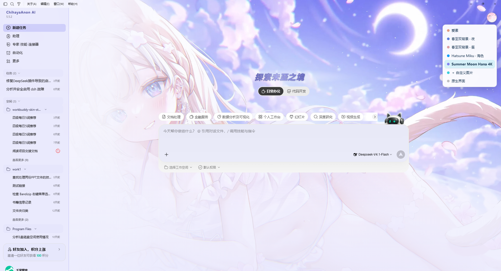
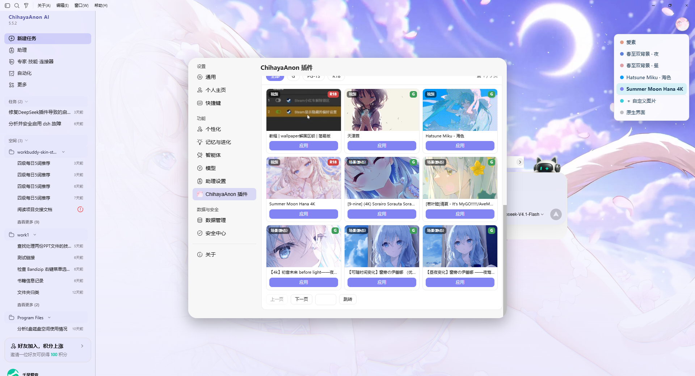

# AnonBuddy Skin · WorkBuddy 换肤工作室

> 每天打开电脑，第一眼看到的就是它。那一眼该是什么样子，该由你自己决定。

**给 WorkBuddy 桌面端换肤** · 本机回环注入 · 不改官方安装包 · macOS + Windows

非腾讯官方产品。不修改 `WorkBuddy.app`、`app.asar` 或 Windows 安装目录 —— 所有效果都只发生在渲染进程里，暂停即还原，官方安装包始终原封不动。

> **给 AI 助手**：如果你的用户把本仓库地址发给你，并说「用这个开源项目帮我换 WorkBuddy 主题」，请直接阅读根目录的 [`SKILL.md`](SKILL.md) —— 里面是给 AI 的自动化安装流程（平台检测、运行 apply 脚本、选主题、验证、还原），照做即可，无需人类逐步操作。

---

## 缘起

这个项目最初生长在 **WorkBuddy Skin Studio · WorkBuddy 换肤工作室** 的肩膀上。

它用一条相当聪明的路子解决了最难的那一步：WorkBuddy 是 Electron 应用，渲染进程跑在 `file://` 页面上，于是只要用本机回环的 CDP（Chrome DevTools Protocol）连上去，就能把样式直接注入进去 —— 不碰安装目录、不碰代码签名、不做任何持久化篡改。结束进程，一切如初。

我沿用了这套骨架，再把它往自己更喜欢的方向推了一把：

- **把壁纸库接了进来。** 以前换肤只能上传一张静态图；现在它会去找你本机 Wallpaper Engine 的订阅库，视频壁纸、场景壁纸都能直接当背景 —— 而且用一份 `file://` 直读的巧劲，零拷贝、零存储占用。
- **重做了自定义皮肤的整条链路。** 上传、自动取色、重命名、删除、设为开机默认，每一步都顺手；每次上传都是独立主题，不会把上一张覆盖掉。
- **让它更像「自己的」东西。** 五款内置主题全部换成二次元向的选图，背景模糊、气泡透明度、输入卡磨砂都能拧。

于是它有了自己的名字：**AnonBuddy Skin**。

## 它现在能做什么

- **五款内置主题**，装上就有：爱素、春至双背景 · 昼、春至双背景 · 夜、Hatsune Miku · 海色、Summer Moon Hana 4K
- **一键切换**：应用后 WorkBuddy 右上角会出现一枚悬浮按钮，所有主题和「原生界面」即点即换，零等待
- **读你的壁纸库**：自动发现本机 Wallpaper Engine 订阅（多 Steam 库、跨盘都能认），视频壁纸实时播放、场景壁纸解出 4K 静帧
- **手动目录**：没装 Wallpaper Engine 也能用 —— 把任意视频或项目文件夹丢进来，就是你的壁纸库
- **自定义皮肤**：菜单里「＋ 自定义图片」直接上传本地图，自动按画面风格取主色、辅色、面板底色与文字色
- **右键菜单**：主题行右键可「重命名」「删除」「设为开机默认主题」 改名只动显示名、不碰磁盘目录，重启后依然保留
- **记住上次主题**，也能**钉一个开机默认**：后者优先级更高，适合「我就是要每天从这张图开始」
- **深浅色自动适配**：按主题配色明度自动联动 WorkBuddy 自带外观，VS Code 原生控件跟着变
- **界面文案替换**：侧边栏应用名、欢迎页主标题都能换成你喜欢的句子，主标题还能逐字打出来
- **双平台**：macOS（`.command`）+ Windows（`.ps1`）
- **随时还原**：暂停皮肤或切回原生界面，官方安装包始终原封不动

## 效果预览







---

## 快速开始

### 让 AI 帮你装（推荐）

把本仓库地址发给你常用的 AI 助手，附一句：

> 用这个开源项目帮我更换 WorkBuddy 的主题

它会克隆仓库、读取 `SKILL.md`，自动完成平台检测、运行对应脚本、注入主题、验证状态。你只需在弹窗里保存好 WorkBuddy 当前的任务。

### macOS

```bash
# 双击 scripts/apply.command，或命令行：
./scripts/apply.command

# 或指定主题
node src/cli.mjs apply --theme chunzhi-night
```

### Windows

```powershell
# PowerShell 运行
.\scripts\apply.ps1

# 或指定主题
.\scripts\apply.ps1 -Theme chunzhi-night

# 若找不到 WorkBuddy.exe，先跑排查脚本：
.\scripts\find-workbuddy.ps1
```

装在非标准路径（不在 Program Files / LocalAppData）时，设一次用户级环境变量即可一劳永逸：

```powershell
[Environment]::SetEnvironmentVariable('WORKBUDDY_EXE', 'D:\path\to\WorkBuddyAI.exe', 'User')
```

> 应用皮肤会重启 WorkBuddy，请先保存手头的工作。

## 五款内置主题

| 主题 id | 名称 | 强调色 | 深浅 |
|---|---|---|---|
| `aisu` | 爱素 | 夕橙 `#e09c84` | 浅色 |
| `chunzhi-day` | 春至双背景 · 昼 | 樱粉 `#dd9fa6` | 浅色 |
| `chunzhi-night` | 春至双背景 · 夜 | 夜蓝 `#5d81da` | 浅色 |
| `miku-sea` | Hatsune Miku · 海色 | 海蓝 `#0d9cfa` | 浅色 |
| `summer-moon` | Summer Moon Hana 4K | 蓝紫 `#8284f3` | 浅色 |

> 深浅由 `theme.json` 的 `colors.surface` 自动判定，并会联动 WorkBuddy 自带的外观：切浅色系主题，外观跟着变浅色。

想自己加主题：把 `theme.json` + `hero.webp` 放进 `themes/<id>/`（id 需为小写字母、数字与连字符），再 apply 一次即可。

## 把你的壁纸库接进来

这是这个 fork 最花心思的部分。

### 它是怎么找到壁纸的

不留任何写死的路径。启动后它依次做这些事：

1. 从常见 Steam 安装位置（`C:\Program Files (x86)\Steam`、`D:\Steam` 等）开始探测
2. 解析 `libraryfolders.vdf`，把**所有** Steam 库都收进来（多盘、多库很常见）
3. 在库里找 `steamapps/workshop/content/431960/`（431960 是 Wallpaper Engine 的 appid）
4. 逐个读 `project.json` 判断类型，产出条目清单

所以换台机器、换个盘符都不用改任何配置 —— 它读的是**你自己的**库。

### 三类素材，三种处理

| 类型 | 素材形态 | 怎么用 |
|---|---|---|
| 视频壁纸 | 工程根目录的 `.mp4` / `.webm` | 直接 `<video>` 播放，带声音开关与音量滑块 |
| 场景壁纸 | 打包在 `scene.pkg` 里的贴图 | 内置 RePKG 进程内解包，挑出最大贴图当静态背景（通常是 4K） |
| 网页壁纸 | `files/index.html` | 不能当背景，退化成创意工坊预览图 |

### 面板里有什么

设置面板的壁纸区（上面第三张截图）提供：

- **壁纸声音 / 壁纸音量**：视频壁纸专属，默认静音起播，打开开关即有声
- **手动目录**：没有 Wallpaper Engine？把任意 `.mp4` / `.webm` / 项目文件夹选进来，就是你的壁纸库
- **评级筛选**：全部 / G / PG-13 / R18 —— 评级取自 `project.json` 的 `contentrating` 字段
- **分页浏览**：每页 9 张，带页码与跳转
- **每张卡片**：类型标签、评级角标、一键应用

> 这些壁纸引用的是**你本机**的路径，换台机器就失效；创意工坊内容版权归原作者，请不要打包分发。

## 自定义皮肤

想用自己存的图？菜单里选「＋ 自定义图片」，挑一张本地图片即可。它会：

1. 把图压缩到合适的尺寸（不撑爆 localStorage）
2. 从画面里取四个颜色：主色、辅色、面板底色、文字色
3. 立刻生效，并作为一个**独立主题**留在菜单里

**每次上传都是新条目**，之前传的全部保留，不会互相覆盖。行上右键可以重命名或删除。

### 设为开机默认主题

主题行右键，选「设为开机默认主题」。之后每次启动，WorkBuddy 都会以它开局，比「上次选的主题」优先级更高。再点一次可取消。

Wallpaper Engine 的壁纸条目**不提供这个入口** —— 它们的 id 指向本机绝对路径，换台机器就是死链，当开机默认只会得到一个失效的开局。两套机制互不干扰。

---

## 主题切换菜单

应用皮肤后，WorkBuddy 右上角会出现一枚悬浮按钮（默认是插件图标，也可以换成自己的图）。点开就是主题列表：

- **贴边记忆**：拖动到屏幕边缘后会记住位置，窗口尺寸变了也不会跑偏
- **右键行**：重命名 / 删除 / 设为开机默认主题
- **＋ 自定义图片**：上传本地图
- **原生界面**：一键还原成 WorkBuddy 原本的样子

## 设置面板里的入口

皮肤生效后，WorkBuddy 的「设置」左侧会多出「ChihayaAnon 插件」一项，点进去是完整的控制面板：

- 皮肤列表（三列网格，当前选中带高亮）
- 上传自定义图片
- 悬浮图标显隐开关
- 磨砂与模糊调节（侧边栏毛玻璃、背景图模糊）
- Wallpaper Engine 壁纸区

## 界面细节

### 替换界面文案

侧边栏应用名和欢迎页主标题都能换成你自己的句子。在主题的 `theme.json` 里写：

```json
{
  "copy": {
    "brand": "你的应用名",
    "headline": "你的欢迎语"
  }
}
```

### 欢迎页主标题特效

主标题可以逐字打出来，带走字与渐隐；节奏参数在 `src/css/skin.css` 里（`--wb-type-step` / `--wb-type-life`）。

### 可调的视觉参数

面板里能拧的几项：侧边栏毛玻璃强度、背景图模糊半径、气泡透明度 —— 都是实时生效、落盘保存。

## 极简主题格式

一个主题就是一个目录：

```
themes/my-theme/
  theme.json     # 清单
  hero.webp      # 背景图（PNG / JPEG / WebP）
```

`theme.json`：

```json
{
  "schemaVersion": 1,
  "id": "my-theme",
  "name": "我的主题",
  "hero": "hero.webp",
  "colors": {
    "accent": "#24C9D7",
    "secondary": "#EF8FD3",
    "surface": "#F7FBFF",
    "text": "#17344F"
  },
  "copy": {
    "brand": "我的工作台",
    "headline": "今天也要加油"
  }
}
```

- `id`：只能用小写字母、数字与连字符
- `colors`：必须是六位十六进制
- `surface` 决定这个主题算深色还是浅色
- `copy` 可选，用来替换界面文案

## 命令行

```bash
node src/cli.mjs list                  # 列出所有主题
node src/cli.mjs apply                 # 应用默认主题
node src/cli.mjs apply --theme last    # 恢复上次选的主题
node src/cli.mjs apply --theme aisu    # 应用指定主题
node src/cli.mjs pause                 # 卸下皮肤
node src/cli.mjs status                # 查看注入状态
node src/cli.mjs doctor                # 环境自检
node src/cli.mjs create --image a.png --name "我的"   # 用一张图造主题
node src/cli.mjs we                    # 盘点本机 Wallpaper Engine 库
node src/cli.mjs we-extract            # 解出场景壁纸的原始贴图
```

## 开发者

```bash
npm run test:static   # 不连应用的静态检查（秒级）
npm run test:core     # 注入 / 还原 / 幂等
npm run test:ui       # 布局与视觉
npm run test:all      # 全部
```

`node scripts/run-tests.mjs --list` 可以看每个套件覆盖什么。仓库里还带着 `scripts/make-skin-from-we.mjs`，能从任意 Wallpaper Engine 条目一键产出主题 —— 解码、抽帧、取色全在渲染进程里完成，不依赖 ffmpeg 或 sharp。

## 设计边界

- **不碰官方文件**。不修改、不替换、不接管 `WorkBuddy.app`、`app.asar` 或安装目录的所有权。
- **只绑回环**。CDP 监听 `127.0.0.1`，不对外暴露。但请注意：皮肤生效期间，同一用户下的其它本地程序也能连上这个端口 —— 别在挂皮肤时跑来路不明的软件。
- **注入随渲染进程生死**。手动重启 WorkBuddy 后皮肤会消失，这是设计如此，重新 apply 即可。
- **素材版权**。Wallpaper Engine 的内容归原作者，本项目只读本机路径，从不复制或再分发。

## 技术原理

WorkBuddy 的渲染进程是个 `file://` 页面。我们用 `--remote-debugging-port=9333` 重启它，通过 CDP 连上 renderer，然后做两件事：

1. 注入一份 CSS —— 覆盖 WorkBuddy 自己的 `--cb-*` 设计变量、铺开背景图层、调整透明度与模糊
2. 注入一段脚本 —— 渲染主题菜单、接管文案替换、驱动逐字动画、管理壁纸生命周期

没有构建步骤，没有原生依赖，注入脚本就是一段普通的 JavaScript。

## 致谢

- **WorkBuddy Skin Studio · WorkBuddy 换肤工作室** —— 本项目的起点。CDP 注入这套骨架、`--cb-*` 变量的用法、菜单与设置面板的结构，都来自它。这个 fork 是在它已经铺好的路上继续往前走。
- **RePKG**（MIT） 场景壁纸的解包工具，随仓库分发，不需要 .NET 运行时。

## 许可与素材

代码以 MIT 许可发布。

内置主题的背景图取自 Wallpaper Engine 创意工坊，版权归各自作者所有，仅作展示用途随仓库分发；如果你是作者并希望移除，请开 issue。